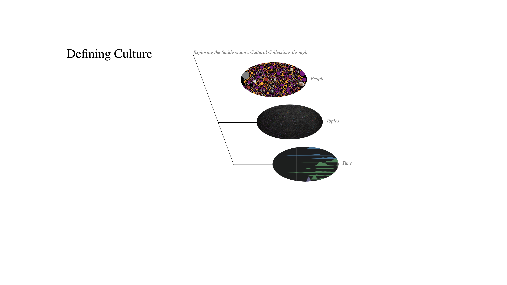
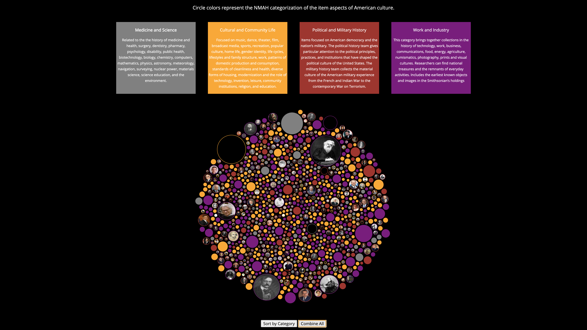
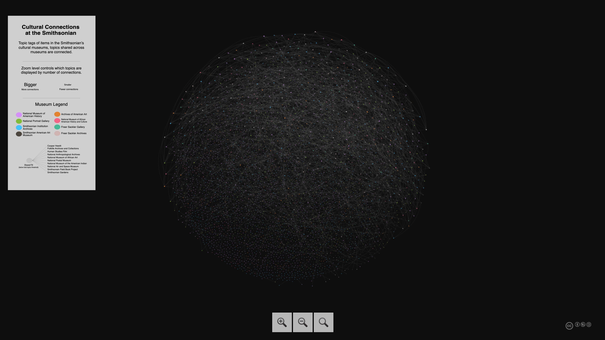
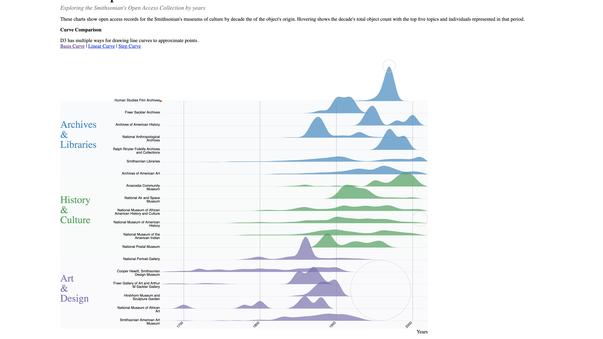
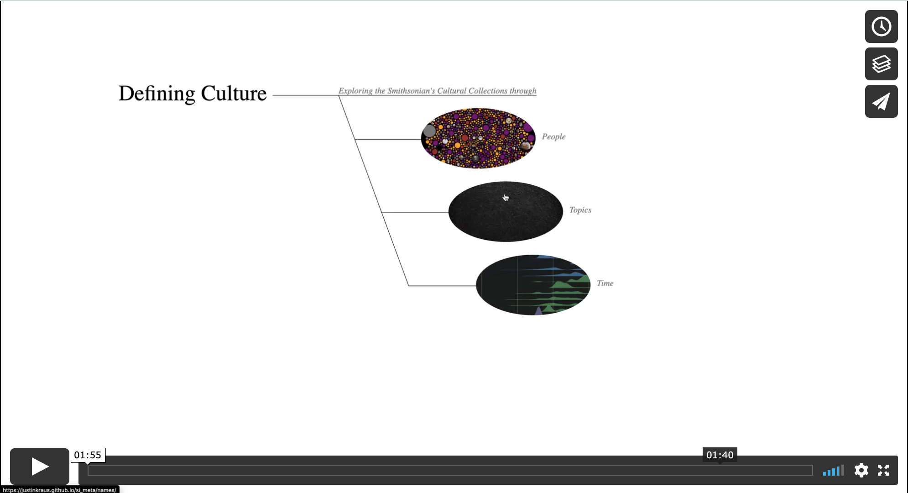

# Defining Culture
Exploring the Smithsonian’s Cultural Collections Open Access metadata.

Combined repository for my explorations around the SI Metadata, accessible at [http://justinkraus.github.io/si_meta/](http://justinkraus.github.io/si_meta/)

## Associated with History
Top People within the National Museum of American History's Open Access metadata

## Connected Culture
Exploration of topics shared across Open Access cultural collections.

## The Shape of Time
Analyzing represented decades across Open Access cultural collections.

